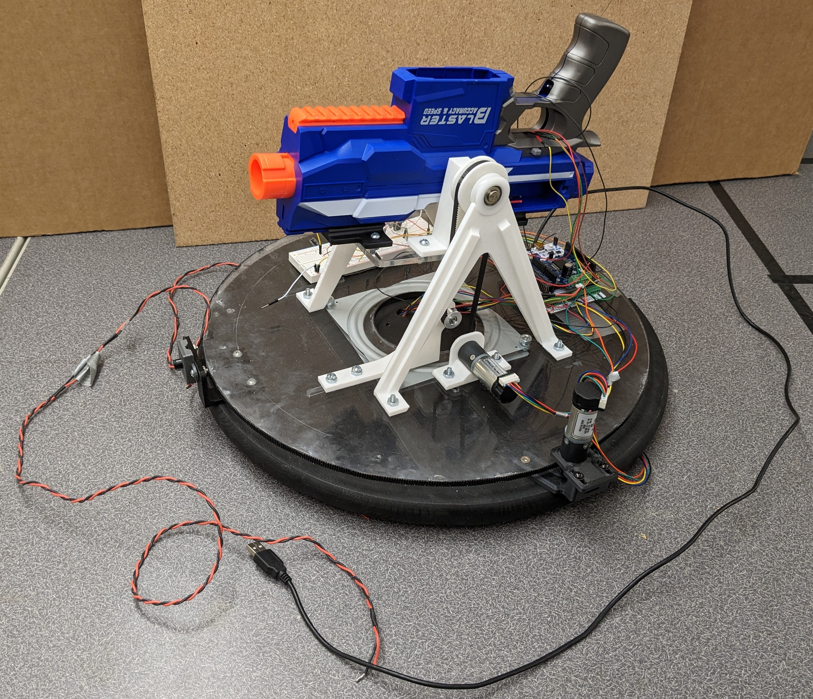
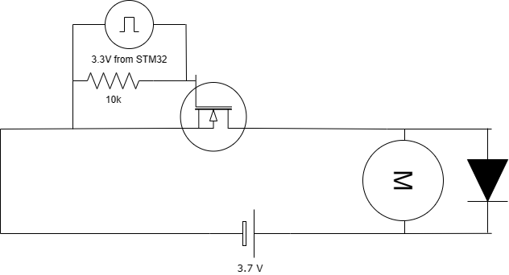
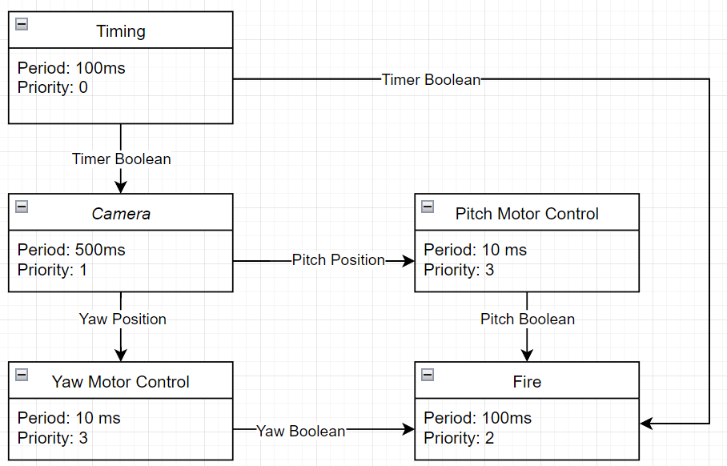
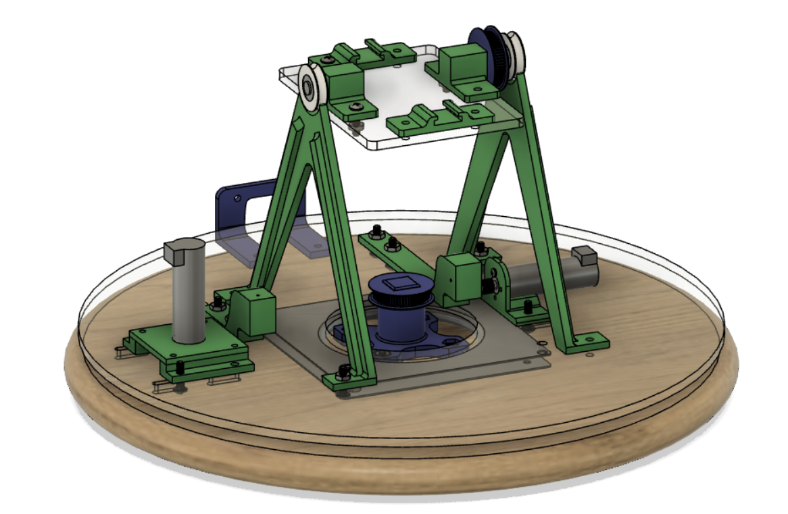

# ME 405 Term Project
This directory contains the code required to run an automated nerf turret using an mlx90640 thermal camera with an STM32 chip running micropython. The turret was built as the final term project for the ME405 mechatronics class at Cal Poly. The purpose of the design was to integrate simultaneous task execution with a custom mechanical design.

 <b> Figure 1: </b>Turret Prototype

## Overview of Hardware
Our hardware consists of a fully automatic nerf rifle placed on a pivoting stand that rotates on a turn table. The rifle mounting is custom 3D printed to allow for specific geometry that fits our off the shelf parts (including the rifle). We bypassed some of the internal electronics via breadboard, which is mounted to our acrylic turntable. The tilt of the stand and the rotation of the turntable are controlled by our tub motors, which are connected to our MCU that is also mounted to our turntable. The thermal camera and yaw motor are mounted to our fixed wooden base, and our cable routing accomodates for its rotation.

 <b> Figure 2: </b> Full CAD Design, Color Coded

We used a pair of 3D printed parts to connect to the rifle (purple) in figure 2b. These parts are screwed onto an acrylic plate (cyan), which also connects to two pivot points via 3D printed parts (red and orange). One of these pivots also connects to a 3D printed gear which controls the pitch of the gun for aiming. The motor (green and pink) and the belt tensioner (orange and cyan) are shown on the right and center of the assembly image respectively.

For the yaw control, the motor is attached to the outside of the turntable as shown on the left of figure 2. A long strip of GT2 belt was superglued to the perimeter of the acrylic base plate (blue) which engages with the teeth of our tub motor (green) shown on the left of figure 2. Because of this mounting, the motor does not rotate with the acrylic plate. The wires are twisted together and route under the wood base plate and up through a hole in its center. The wires are long enough that the orientation of the stand does not effect the connection between the microcontroller and the motor. The perimeter belt does not make a complete loop, preventing full rotations and protecting the wiring.

The acrylic base plate (blue) was laser cut, and contains extra mounting slots since part of the design had to be changed after the plate was machined (see the Results section below). This acrylic plate connects to our wood base plate via a lazy susan style turntable from Home Depot. The wood base plate is also one of their stock parts, and we drilled mounting holes for our mounting bolts and added thick rubber feet to give room for our wiring and add grip to the turret.

The thermal camera is mounted to the base of the turn table, ensuring that it is always facing the same position, not matter how the gun rotates. This is due to the rules of the competition that this turret competed in, as the target was only given to be in front of the turret.

 <b> Figure 3: </b> Motor Driver Circuit

The microcontroller and the breadboard circuit for firing the gun are attached to the same turntable as the stand. The firing circuit is composed of two switches that connect directly to the two motors of the blaster; one motor for the piston that loads the dart and one for running the flywheel that propels the dart out of the blaster. Figure 3 above shows the model of the driver circuit that used for both of the motors (1 circuit per motor a total of two circuits in the project). Each motor is placed in series to a respective NMOS transistor using the low side of the motor to interface with the drain pin of the NMOS. The positive side of the motor is attached in series to the motor power source set to the same value as the 3.7 volt battery used in the blaster. The switches are set up to be simple motor driver circuits with logic level, NMOS transistors that will become forward active when a voltage of 2.5 volts or higher is sent to the gate pin. The gate of the NMOS' are connected to the STM32 and use a 3.3V output pulse to turn on the switch. The switch has a built-in flyback diode (as seen in the datasheets for both the FDP6030BL and the IRLZ44N) to protect from a potential voltage spike within the circuit. Below are the links to the NMOS datasheets:
https://www.mouser.com/catalog/specsheets/international%20rectifier_irlz44n.pdf
https://www.mouser.com/datasheet/2/149/FDP6030BL-111072.pdf

## Overview of Software
Our software preforms three main jobs, controlling the motors, determine where the target is from the camera, and timing the firing with motors to ensure it is only fired at a certain point. The camera only begins firing after 5 seconds have passed, since this it when the target will stop moving. The rifle will only fire once the motors indicate that they are withing a certain tolerance of the target. More indepth overview of our code can be found in our accompanying code documentation generated by doxygen, located in our github docs folder or at our documentation page link.

 <b> Figure 4: </b> Task Diagram

## Results
Our overall project was well designed and implemented, with a few major hurdles that were cleared during design and one last minute roadblock that caused a critical failure in our system.

Our heavy reliance on 3D printed parts allowed for simple custom geometry that was much easier to develop than could be done by hand, such as the mounting parts for the tub motors. However, other parts required multiple iterations. Some parts needed redesigns as they were not made with the correct tolerances and features for smooth and accurate 3D printing. Other parts experienced critical print failures due to difficulties with the machine, but some (such as the pivots mentioned above) could be used by re-drilling failed mounting holes by hand in the lab.

The largest design change came when we changed our entire yaw control design. Our first iteration, shown in figure 5, included a fixed central gear (blue) and a plate-mounted motor, but this design is impossible to use for our tub motors. When two gears orbit each other on a belt they do not rotate with respect to each other; their motion is purely translation no matter what their size ratio is (assuming they do not make contact). This means that our tub motor would only make one rotation for every full rotation of the acrylic plate, which is a *terrible* gear ratio. We discovered this issue when the initial design was assembled, since as soon as the teeth of the pulley engaged the motor immediately stopped. This prompted our perimeter-tooth-redesign that is slow but steady and accurate.

 <b> Figure 5: </b> Old CAD design

Our pitch motor also suffers from a poor gear ratio, which gives us very limited control over the pitch angle of our turret. Fortunately only one angle of rotation is required and our system controls two additional motors, the flywheel and loading pin, covering our motor quota. For these reasons the pitch was designed and assembled, but not implemented.

The MOSFETs we were using for our firing mechanism were damaged during our testing, resulting in our firing mechanism also failing. Since MOSFETs are voltage driven devices, regulation of the input voltage is crucial to preserving the longevity of the device. The voltage rating for both NMOS' was a minimum of 2.5 volts and a max of 20 volts, however, should the motor run for too long in the driver configuration, there is a risk of a built up voltage spike within the 10k resistor loop as pictured in figure 3 above. The flyback diodes in both of the NMOS' did help protect from this issue at the beginning of our testing by forcing the build up of voltage within the circuit to gather outside of the NMOS rather than within it, however, prolonged testing without breaks ran the risk of voltage overload. An extra diode was placed in parallel with the 10k resistor, but by the time it was added, the damage to the MOSFETs was done. In the event of voltage damage, the MOSFETs will affect the load that they are supporting in this case, the motors began to slow and would take longer to react to the 3.3 volt pulse. 
