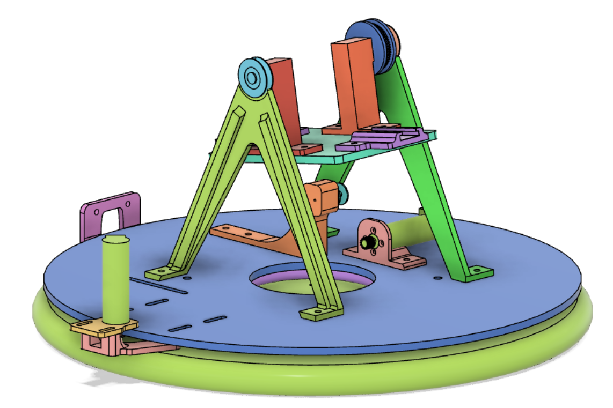

# ME 405 Term Project
This directory contains the code required to run an automated nerf turret using an mlx90640 thermal camera with an STM32 chip running micropython. The turret was built as the final term project for the ME405 mechatronics class at Cal Poly. The purpose of the design was to intergrate simulatious task execution with a custom mechanical design.

 <b> Figure 1: </b>Turret Prototype

## Overview of Hardware
Our hardware consists of a fully automatic nerf rifle placed on a pivoting stand that rotates on a turn table. The rifle mounting is custom 3D printed to allow for specific geometry that fits our off the shelf parts (including the rifle). We bypassed some of the internal electronics via breadboard, which is mounted to our acrylic turntable. The tilt of the stand and the rotation of the turntable are controlled by our tub motors, which are connected to our MCU that is also mounted to our turntable. The thermal camera and yaw motor are mounted to our fixed wooden base, and our cable routing accomodates for its rotation.
| (a) Full CAD | (b) Color Coded |
|     :---:    |     :---:      |
|  |  |

 <b> Figure 2: </b> Full CAD Design

We used a pair of 3D printed parts to connect to the rifle as shown in purple in figure 2b. These parts are screwed onto an acrylic plate shown 

For the yaw control, the motors are attached to the outside of the turntable. The turntable has teeth on the perimeter, allowing it to interact with the turntable. The wires are conncted through the middle of the table. The wires are long enough that the orientation of the stand does not effect the connection between the microcontroller and the motor.

The thermal camera is mounted to the base of the turn table, ensuring that it is always facing the same position, not matter how the gun rotates. This is due to the rules of the competition that this turret competed in. Since we do not need to hit a moving target, we only need to know where our target is after at a set amount of time.

The microcontroller and the breadboard circuit for firing the gun are attached to the same turntable as the stand. The firing circuit is composed of two switches that connect directly to the two motors of the blaster; one motor for the piston that loads the dart and one for running the flywheel that propels the dart out of the blaster. The switches are set up to be simple motor driver circuits with logic level, NMOS transistors. The gate of the NMOS' are connected to the STM32 and use a 3.3V output pulse to turn on the switch. The switch is driving the motor in series and has a flyback diode to protect from a potential voltage spike within the circuit. 

## Overview of Software
Our software preforms three main jobs, controlling the motors, determine where the target is from the camera, and timing the firing with motors to ensure it is only fired at a certain point. The camera only begin firing after 5 seconds have passed, since this it when the target will stop moving. The rifle will only fire once the motors indicate that they are withing a certain tolerance of the target. More indepth overview of our code can be found at (INSERT DOXYGEN LINK HERE)

## Results
Due to quality of parts and time constrains, our physical system did not preform as well as intended. Due to our gears for the pitch control being too weak, we could not control the pitch of the gun accurately. This meant that our final design did not have any pitch control. The mosfets we were using for our firing mechanism lost power during our testing, resulting in our firing mechanism also failing. The only part of our design that performed adequately was the yaw accuracy. The turret was able to reach it's desired location, which was determined by the thermal camera, almost every time.
